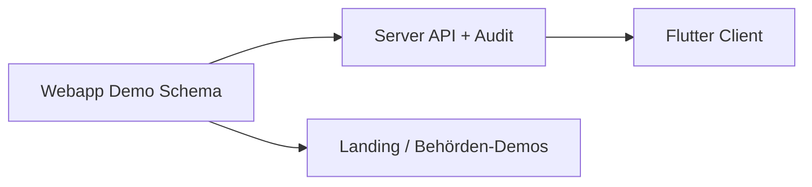

# Fahrplan: Wachalltag für RD, Feuerwehr, FFW & Polizei

Stand: 9. August 2026

Ziel: Funktionen liefern, die **weder typische Einsatzsysteme** (ELS,
Alarmierung, Vorgang, eProtokoll) **noch das heutige Wachbuch** abdecken —
ohne die Produktgrenze zu verletzen.

## Produktgrenze (unverändert)

**Im Scope:** Schichtübergabe, Mängel/To-dos, Fahrzeug-/Gerätestatus,
Checklisten, Schlüssel-/Pool-Geräte, Quittierung, Offline-Lesen, leichte
Auswertung.

**Außer Scope:** Alarmierung, Einsatzleitung, Patienten-/Vorgangsdaten,
Enterprise-Dienstplan, Abrechnung, vollständige Personalverwaltung.

## Ausgangslage

| Baustein | Heute |
| --- | --- |
| Server | Übergaben, Kalender, Kasse, Checklisten, Demo-Modus |
| Mobile Client | Lesen + Checklisten-Abschluss; Offline-Demo inkl. Mängel/Assets/Quittierung (Contract `SCHEMA-WACHALLTAG`) |
| Webapp (`landing/app/`) | Offline-Demo SPA, gleiche Profile |

## Umsetzungsprinzip

1. **Zuerst Webapp-Demo** mit lokalem Datenmodell (schnell sichtbar, kein
   Server-Release nötig).
2. **Dann gemeinsames JSON-Schema** in Client + Server spiegeln.
3. **Danach Mobile** gegen echte API.
4. Jede Phase liefert einen nutzbaren Stand pro Organisation (RD / BF / FFW /
   Polizei), nicht nur UI-Attrappen.



---

## Phase A — Gemeinsames Datenmodell (Fundament)

**Ziel:** Ein Schema für Mängel, Assets und Quittierungen, das Webapp und
später API teilen.

### Entitäten (Vorschlag)

```json
{
  "defect": {
    "id": 1,
    "title": "…",
    "description": "…",
    "asset_ref": "HLF-20 / RTW-1 / FuStW-3",
    "priority": "urgent|important|normal",
    "status": "open|in_progress|waiting|done",
    "owner": "demo-waf",
    "due_at": "2026-08-12T12:00:00Z",
    "category": "vehicle|material|safety|facility|key|device",
    "org_tags": ["feuerwehr"]
  },
  "asset": {
    "id": "hlf-20",
    "label": "HLF 20",
    "kind": "vehicle|device|key",
    "status": "ready|limited|oob|workshop",
    "note": "Atemschutz 3 außer Betrieb"
  },
  "ack": {
    "handover_id": 11,
    "by": "demo-mitglied",
    "at": "2026-08-09T06:00:00Z"
  }
}
```

### Umsetzung

| Schicht | Arbeit |
| --- | --- |
| Webapp | `data.js` um `defects`, `assets`, `acks` erweitern |
| Docs | `docs/SCHEMA-WACHALLTAG.md` als Vertrag |
| Server | später `GET/POST /api/v1/defects/`, `/assets/`, Quittierung an Handover |
| Flutter | Modelle + Demo-API + Mängel-Screen / Statusboard / Ack (501 bis Server) |

**Akzeptanz:** Webapp und Flutter-Demo zeigen Mängel und Assets je Organisation ohne Server.

---

## Phase B — Mangel-Workflow (Prio 1)

**Nutzen:** Offene Punkte bleiben Owner + Frist + Status — Kernlücke aller
vier Organisationen.

### Webapp

- Neuer Nav-Punkt **Mängel**
- Liste mit Filter (Status, Priorität, überfällig)
- Detail: Owner setzen, Status wechseln, Frist anzeigen
- Von Übergabe aus „Als Mangel übernehmen“ (Demo: kopiert Felder)
- Dashboard-Kachel: offene / überfällige Mängel

### Server (Folge)

- Append-only Statuswechsel + Audit
- Rollen: Mitglied darf anlegen/übernehmen, Schichtleitung schließt ab
- Keine Patienten-/Vorgangsfelder

### Mobile

- Mängel-Tab oder Filter in Übergaben (`category=task/safety` → Defects)
- Push später optional nur „Anzahl offen“, kein Inhalt auf Lockscreen

**Behörden-Fokus**

| Org | Beispiel-Mangel |
| --- | --- |
| RD | Defi-Akku, Kühlschrank-Log |
| BF | Atemschutz außer Betrieb |
| FFW | Schlauchturm-Licht, Heizung Gerätehaus |
| Polizei | Reifen FuStW, fehlender Zellenschlüssel |

---

## Phase C — Fahrzeug-/Geräte-Statusboard (Prio 3)

**Nutzen:** Auf einen Blick: einsatzklar / eingeschränkt / außer Betrieb.

### Webapp

- Kachelreihe oder Board auf der Übersicht
- Ampel: `ready` · `limited` · `oob` · `workshop`
- Klick öffnet verknüpfte offene Mängel

### Server

- `assets` stationsbezogen, Modul-Flag `assets`
- Statuswechsel erzeugen optional automatischen Mangel

### Mobile

- Kompakte Statuszeile auf Übersicht (große Touch-Ziele)

---

## Phase D — Übergabe-Quittierung (Prio 5)

**Nutzen:** „Gelesen / übernommen“ zwischen Schichten nachweisbar.

### Webapp

- Am Übergabe-Detail: Button **Übernommen**
- Liste der Quittierungen (Name + Zeit)
- Übersicht: „2 unquittierte dringende Übergaben“

### Server

- `POST /api/v1/handovers/{id}/ack/`
- Idempotent pro User; Historie append-only

### Mobile

- Gleicher Button im Detail-Sheet

---

## Phase E — Anhänge / Fotos (Prio 2, serverpflichtig)

**Nutzen:** Mangelzustände belegen.

### Reihenfolge

1. Server: Upload-Vertrag, Typ/Größe, Rechte, Löschfristen
2. Webapp: Datei-Auswahl nur gegen Demo-Blob/`objectURL` bis API da ist
3. Mobile: Kamera/Galerie mit denselben Limits

**Hinweis:** Webapp kann UI + Demo-Vorschaubilder früher zeigen; produktiver
Upload wartet auf Server.

---

## Phase F — Wiederkehrende Checks (Prio 4)

**Nutzen:** Tägliche/wöchentliche Pflicht ohne manuelles Neuanlegen.

### Erweiterung Checklisten

- `interval`: `daily|weekly|monthly`
- `due_next`, `overdue`
- Webapp: Bereich „Fällig heute“
- Server: Scheduler oder lazy evaluation beim Abruf
- FFW: Gerätehaus-Wochenheck; RD: Fahrzeugcheck Schichtbeginn

---

## Phase G — Schlüssel- & Pool-Geräte-Log (Prio 6, Polizei zuerst)

**Nutzen:** Wer hat Schlüssel / Bodycam / Dock.

### Webapp

- Nav **Geräte & Schlüssel**
- Checkout / Checkin mit Benutzer + Zeit
- Warnung bei überfälliger Rückgabe

### Server

- Eigenes Modul `inventory_log` oder `assets` mit Bewegungen
- Keine Asservaten-/Vorgangsdaten

### Auch nutzbar für

- BF/FFW: Ersatzschlüssel Gerätehaus
- RD: Funkgerät-Pool

---

## Phase H — Offline-Lesecache (Prio 7)

Bereits in `docs/MARKET-RESEARCH.md` verschoben — hier eingeordnet:

1. Verschlüsselter Cache im Mobile-Client
2. Webapp: `localStorage`/`IndexedDB` nur für Demo-Zustand (kein Ersatz für
   produktiven Offline-Client)
3. Invalidierung bei Serverwechsel / Logout

---

## Phase I — Leichte Auswertung (Prio 8)

- Offene Mängel nach Alter / Owner
- Überfällige Checks
- Asset-Ampel-Quote
- Webapp zuerst als reine Client-Aggregation über Demo-/API-Listen
- Server später optionale Report-Endpoints

---

## Behörden-Matrix je Phase

| Phase | RD | BF | FFW | Polizei | Webapp zuerst? |
| --- | --- | --- | --- | --- | --- |
| A Schema | ● | ● | ● | ● | ja |
| B Mängel | ● | ● | ● | ● | ja |
| C Statusboard | ● | ● | ○ | ● | ja |
| D Quittierung | ● | ● | ○ | ● | ja |
| E Anhänge | ● | ● | ● | ● | UI ja / Upload Server |
| F Recurring | ● | ● | ● | ○ | ja |
| G Schlüssel/Pool | ○ | ○ | ○ | ● | ja |
| H Offline | ● | ○ | ● | ● | Mobile |
| I Auswertung | ● | ● | ● | ● | ja |

● = Kern · ○ = sekundär

---

## Webapp-Umsetzung (konkret)

Pfad: `landing/app/`

| Datei | Rolle |
| --- | --- |
| `data.js` | Profile inkl. `defects`, `assets`, `acks`, optional FFW |
| `app.js` | Views: `defects`, `assets`, Quittierung im Detail |
| `styles.css` | Board-/Mangel-Layouts im bestehenden Design-System |
| `index.html` | Nav-Einträge |

### Navigationsziel (nach Phase B–G)

```
Übersicht | Übergaben | Mängel | Geräte | Konto
(+ Module Kalender/Kasse/Checklisten über Übersicht)
```

### Demo-Deep-Links

- `/app/?service=rettungsdienst`
- `/app/?service=feuerwehr`
- `/app/?service=ffw`
- `/app/?service=polizei`

---

## Server-Reihenfolge (wenn API folgt)

1. `defects` CRUD + Statusübergänge + Audit  
2. `assets` Status  
3. `handovers/{id}/ack/`  
4. Attachments  
5. Checklisten-Intervalle  
6. Inventory-Log (Schlüssel/Geräte)

Spiegel: API-Doku im Server-Repo; Client erst nach Contract-Freeze.

---

## Definition of Done je Phase

- Webapp-Demo mit Musterdaten für betroffene Organisationen
- Schema in diesem Dokument oder `docs/` stabil
- Keine sensiblen Einsatz-/Patientendaten in Beispielen
- Mobile/API nur wenn Vertrag steht
- Landingpage-CTA kann auf neue Webapp-Views verlinken

## Nächster Schritt

Client-seitig erledigt auf diesem Branch:

- Phase **A–D** Webapp + Flutter-Demo  
- Phase **E** Webapp-Demo-Anhänge (objectURL, kein Upload)  
- Phase **F** Intervalle/`due_next` in Webapp + Flutter-Modell/UI  
- Phase **G** Inventar-Checkout Webapp + Flutter  
- Phase **I** Webapp-Auswertung (Client-Aggregation)  
- Flutter-HTTP für `defects` / `assets` / `inventory` / `acks` (404 = Modul aus)

Als Nächstes im **Server-Repo**: OpenAPI einfrieren und echte Endpoints liefern.  
Phase **H** (Offline-Lesecache) bleibt Mobile-Folgearbeit.
