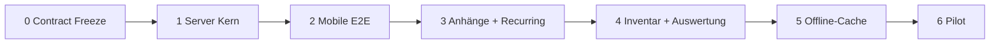

# Fahrplan Welle 2 — Produktiv (Server → Mobile → Pilot)

Stand: 9. August 2026  
Vorgänger: [FAHRPLAN-BEHOERDEN.md](FAHRPLAN-BEHOERDEN.md) (Demo A–I, Client-Vertrag)  
Contract: [SCHEMA-WACHALLTAG.md](SCHEMA-WACHALLTAG.md) · [openapi-wachalltag.yaml](openapi-wachalltag.yaml)  
Server-Handoff: [SERVER-HANDOFF-WACHALLTAG.md](SERVER-HANDOFF-WACHALLTAG.md)

## Ziel

Aus der Offline-Demo eine **produktive Wachen-Nutzung** machen — ohne die
Produktgrenze zu verletzen (kein ELS, keine Patienten-/Vorgangsdaten).

## Leitprinzipien

1. **Server-first** — OpenAPI frieren, dann implementieren, Client nur gegen Freeze.
2. **404 = Modul aus** — optionale Module brechen ältere Server nicht.
3. **Append-only Audit** bei Status und Quittierung.
4. **Eine Org pro Slice** bei Abnahme (RD / BF / FFW / Polizei).
5. **Keine Lockscreen-Inhalte** bei späterer Push (nur Zähler).

## Ausgangslage (nach Welle 1)

| Schicht | Stand |
| --- | --- |
| Webapp Demo | A–G, I lokal |
| Flutter Demo + HTTP | verdrahtet, 404/501 tolerant |
| Schema | dokumentiert |
| Server API Wachalltag | **offen** — Schwerpunkt dieser Welle |

---

## Phase 0 — Contract Freeze

**Repo:** Client (dieses Dokument + OpenAPI) → Spiegel ins Server-Repo

- [x] OpenAPI-Entwurf `docs/openapi-wachalltag.yaml`
- [x] Handoff-Checkliste `docs/SERVER-HANDOFF-WACHALLTAG.md`
- [x] Client-Pfadkonstanten `lib/api/wachalltag_paths.dart` + Tests
- [x] Client: `createDefect` / `updateAssetStatus` gegen Contract verdrahtet
- [ ] Review / Freeze-Tag im Server-Repo (`api-wachalltag-v1-draft` o. Ä.)

**Abnahme:** Contract reviewbar, Pfade und Enums stabil, keine Einsatzdaten in Beispielen.

---

## Phase 1 — Server Kern (Prio 1)

**Repo:** [Rettungswache-Wachbuch](https://github.com/darkspike1988/Rettungswache-Wachbuch)

Reihenfolge:

1. Modul-Flags in `/me/` → `station.modules.defects|assets`
2. `GET/POST /api/v1/defects/`, `POST …/status/`
3. `GET /api/v1/assets/`, `POST …/status/`
4. `GET/POST /api/v1/handovers/{id}/acks/` bzw. `…/ack/`

Rollen (Minimal): Mitglied anlegen/übernehmen; Schichtleitung schließt ab / setzt Asset-Status.

**Abnahme:** Staging-Wache legt Mangel an, wechselt Status, quittiert Übergabe (curl oder Web).

---

## Phase 2 — Mobile gegen echte API (Prio 1)

**Repo:** Client

- Demo-Hosts bleiben; Produktionspfad ohne Sonderfälle
- E2E-Checkliste manuell: Login → Übersicht → Mängel → Status → Quittierung
- Optional: Integrationstest gegen Staging, wenn Secrets vorhanden

**Abnahme:** App gegen Staging ohne `demo-*.wachbuch.local` nutzbar; Module nur bei Flag.

---

## Phase 3 — Belege & Pflicht (Prio 2)

1. **Anhänge** — Upload-Vertrag (Typ/Größe/Rechte/Löschung) → Client Kamera/Galerie  
2. **Recurring Checks** — `interval` / `due_next` / `overdue` vom Server

**Abnahme:** Mangel mit Foto; „fällig heute“ serverseitig.

---

## Phase 4 — Pools & Lagebild (Prio 3)

1. Inventar Checkout/Checkin + Audit  
2. Auswertung in der Flutter-App (Owner, Ampel-Quote, überfällige Checks)

**Abnahme:** Pool-Gerät nachvollziehbar; Schichtleitung sieht Kennzahlen in der App.

---

## Phase 5 — Offline-Lesecache (Prio Feld)

- Verschlüsselter Read-Cache (Übergaben, Mängel, Assets)
- Zeitstempel „zuletzt aktualisiert“
- Invalidierung bei Logout / Serverwechsel
- v1 bewusst **read-only** offline (kein blinder Write)

**Abnahme:** Letzte Lage ohne Netz sichtbar; nach Reconnect konsistent.

---

## Phase 6 — Pilot & Betrieb

- Eine Partnerwache 2–4 Wochen
- Backup/Restore- und Update-Doku Server↔Client
- Optional: stille Push nur als Zähler
- Play/TestFlight-Externals nur nach stabilem Pilot

---

## Bewusst nicht in Welle 2

Alarmierung, ELS, Einsatztagebuch, Patient/Vorgang, Enterprise-Dienstplan,
Abrechnung, Chat als Kernfeature.

---

## Definition of Done (gesamt Welle 2)

- [ ] OpenAPI im Server-Repo gespiegelt und versioniert
- [ ] Phase-1-Endpoints auf Staging grün
- [ ] Flutter E2E gegen Staging ohne Demo-API
- [ ] Mindestens eine Org-Pilot abgeschlossen
- [ ] Keine sensiblen Einsatzdaten in Fixtures/Logs

## Nächster konkreter Schritt

1. Dieses Dokument + OpenAPI mergen (Client).  
2. OpenAPI ins Server-Repo kopieren und Phase 1 implementieren.  
3. Client Phase 2 gegen Staging verdrahten/prüfen.
