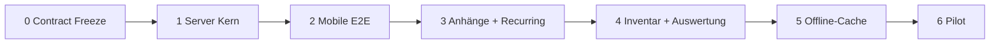

# Fahrplan Welle 2 — Produktiv (Server → Mobile → Pilot)

Stand: 9. August 2026  
Vorgänger: [FAHRPLAN-BEHOERDEN.md](FAHRPLAN-BEHOERDEN.md) (Demo A–I, Client-Vertrag)  
Contract: [SCHEMA-WACHALLTAG.md](SCHEMA-WACHALLTAG.md) · [openapi-wachalltag.yaml](openapi-wachalltag.yaml)  
Server-Handoff: [SERVER-HANDOFF-WACHALLTAG.md](SERVER-HANDOFF-WACHALLTAG.md)  
Pilot: [PILOT-WACHALLTAG.md](PILOT-WACHALLTAG.md) · E2E: [E2E-WACHALLTAG.md](E2E-WACHALLTAG.md)

## Ziel

Aus der Offline-Demo eine **produktive Wachen-Nutzung** machen — ohne die
Produktgrenze zu verletzen (kein ELS, keine Patienten-/Vorgangsdaten).

## Leitprinzipien

1. **Server-first** — OpenAPI frieren, dann implementieren, Client nur gegen Freeze.
2. **404 = Modul aus** — optionale Module brechen ältere Server nicht.
3. **Append-only Audit** bei Status und Quittierung.
4. **Eine Org pro Slice** bei Abnahme (RD / BF / FFW / Polizei).
5. **Keine Lockscreen-Inhalte** bei späterer Push (nur Zähler).

## Ausgangslage (nach Welle 1)

| Schicht | Stand |
| --- | --- |
| Webapp Demo | A–G, I lokal |
| Flutter Demo + HTTP | verdrahtet, 404/501 tolerant |
| Schema | dokumentiert |
| Server API Wachalltag | **offen** — Schwerpunkt dieser Welle (anderes Repo) |

---

## Phase 0 — Contract Freeze

**Repo:** Client (dieses Dokument + OpenAPI) → Spiegel ins Server-Repo

- [x] OpenAPI-Entwurf `docs/openapi-wachalltag.yaml`
- [x] Handoff-Checkliste `docs/SERVER-HANDOFF-WACHALLTAG.md`
- [x] Client-Pfadkonstanten `lib/api/wachalltag_paths.dart` + Tests
- [x] Client: `createDefect` / `updateAssetStatus` gegen Contract verdrahtet
- [x] Anhänge-Pfade im Contract (`/defects/{id}/attachments/`)
- [ ] Review / Freeze-Tag im Server-Repo (`api-wachalltag-v1-draft` o. Ä.)

**Abnahme:** Contract reviewbar, Pfade und Enums stabil, keine Einsatzdaten in Beispielen.

---

## Phase 1 — Server Kern (Prio 1)

**Repo:** [Rettungswache-Wachbuch](https://github.com/darkspike1988/Rettungswache-Wachbuch)

Reihenfolge:

1. Modul-Flags in `/me/` → `station.modules.defects|assets`
2. `GET/POST /api/v1/defects/`, `POST …/status/`
3. `GET /api/v1/assets/`, `POST …/status/`
4. `GET/POST /api/v1/handovers/{id}/acks/` bzw. `…/ack/`

Rollen (Minimal): Mitglied anlegen/übernehmen; Schichtleitung schließt ab / setzt Asset-Status.

**Abnahme:** Staging-Wache legt Mangel an, wechselt Status, quittiert Übergabe (curl oder Web).

**Status Client-Workspace:** blockiert (`NO_SERVER_REPO`) — Umsetzung nur im Server-Repo.

---

## Phase 2 — Mobile gegen echte API (Prio 1)

**Repo:** Client

- [x] Demo-Hosts bleiben; Produktionspfad ohne Sonderfälle
- [x] UI: Mangel anlegen (`DefectsScreen` FAB) + Status
- [x] UI: Asset-Status setzen (Board tippen, Übersicht + Geräte)
- [x] „Als Mangel“ aus Übergabe-Detail
- [x] E2E-Checkliste `docs/E2E-WACHALLTAG.md` (manuell gegen Demo; Staging wenn Secrets)
- [ ] Integrationstest gegen Staging, wenn Secrets vorhanden

**Abnahme:** App gegen Staging ohne `demo-*.wachbuch.local` nutzbar; Module nur bei Flag.
Gegen Demo-Hosts bereits abnehmbar; Staging hängt an Phase 1.

---

## Phase 3 — Belege & Pflicht (Prio 2)

1. **Anhänge**
   - [x] Upload-Vertrag in OpenAPI (JSON-Metadaten + Multipart-Hinweis)
   - [x] Demo/lokal: Beleg-Platzhalter ohne `image_picker`
   - [ ] Server Multipart + Client Kamera/Galerie (nach Server)
2. **Recurring Checks**
   - [x] Client zeigt `interval` / `due_next` / `overdue`
   - [ ] Serverseitige Fälligkeit

**Abnahme:** Mangel mit Foto; „fällig heute“ serverseitig.

---

## Phase 4 — Pools & Lagebild (Prio 3)

1. [x] Inventar Checkout/Checkin (Client + Demo; Server Audit offen)
2. [x] Auswertung in der Flutter-App (Owner, Ampel-Quote, überfällige Checks)

**Abnahme:** Pool-Gerät nachvollziehbar; Schichtleitung sieht Kennzahlen in der App (Demo/Staging).

---

## Phase 5 — Offline-Lesecache (Prio Feld)

- [x] Verschlüsselter Read-Cache (Übergaben, Mängel, Assets) via Secure Storage
- [x] Zeitstempel „zuletzt aktualisiert“ / Offline-Stand
- [x] Invalidierung bei Logout / Serverwechsel
- [x] v1 bewusst **read-only** offline (kein blinder Write)

**Abnahme:** Letzte Lage ohne Netz sichtbar; nach Reconnect konsistent (Demo + Unit-Tests).

---

## Phase 6 — Pilot & Betrieb

- [x] Prozess-Doku `docs/PILOT-WACHALLTAG.md`
- [ ] Eine Partnerwache 2–4 Wochen (Betrieb, nicht Code)
- [ ] Backup/Restore- und Update-Doku Server↔Client (Server-Repo)
- [ ] Optional: stille Push nur als Zähler
- [ ] Play/TestFlight-Externals nur nach stabilem Pilot

---

## Bewusst nicht in Welle 2

Alarmierung, ELS, Einsatztagebuch, Patient/Vorgang, Enterprise-Dienstplan,
Abrechnung, Chat als Kernfeature.

---

## Definition of Done (gesamt Welle 2)

- [ ] OpenAPI im Server-Repo gespiegelt und versioniert
- [ ] Phase-1-Endpoints auf Staging grün
- [x] Flutter E2E gegen Demo; Staging nach Phase 1
- [ ] Mindestens eine Org-Pilot abgeschlossen
- [x] Keine sensiblen Einsatzdaten in Fixtures/Logs (Client-Fixtures geprüft)

## Nächster konkreter Schritt

1. OpenAPI + dieses Dokument mergen (Client).  
2. OpenAPI ins Server-Repo kopieren und Phase 1 implementieren.  
3. Client gegen Staging mit `docs/E2E-WACHALLTAG.md` abnehmen.
